---

#  Complete Guide: Java JSP + MySQL Deployment on AWS EC2 (From Scratch)

---

## 1.  Introduction

This project explains how to:

* Create virtual machines (EC2 instances)
* Deploy a Java JSP application on Tomcat 9
* Connect it to a MySQL database on another server

---

## 2.  Architecture Overview

```
User → Browser → EC2 (Tomcat Server) → EC2 (MySQL Server)
```

* EC2-1 → Application Server
* EC2-2 → Database Server

---

## 3.  Step 1: Create EC2 Virtual Machines (VMs)

---

## 🔹 3.1 Login to AWS

Go to:
 [https://console.aws.amazon.com/](https://console.aws.amazon.com/)

* Login with your AWS account
* Navigate to **EC2 Dashboard**

---

##  3.2 Launch Application Server (EC2-1)

Click **Launch Instance**

### Configuration:

* **Name:** `App-Server`
* **AMI:** Ubuntu Server 22.04
* **Instance Type:** t2.micro (free tier)
* **Key Pair:** Create or select existing (.pem file)

---

###  Create Security Group

Allow:

| Type       | Port | Source    |
| ---------- | ---- | --------- |
| SSH        | 22   | 0.0.0.0/0 |
| HTTP       | 80   | 0.0.0.0/0 |
| Custom TCP | 8080 | 0.0.0.0/0 |

---
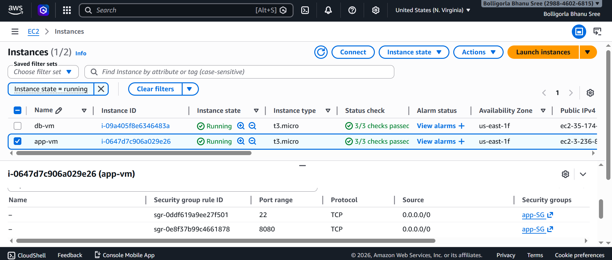
### Launch Instance

Click **Launch Instance**

---

##  3.3 Launch Database Server (EC2-2)

Repeat same steps:

* **Name:** `DB-Server`
* Same AMI and instance type

---

###  Security Group for DB Server

| Type  | Port | Source        |
| ----- | ---- | ------------- |
| SSH   | 22   | 0.0.0.0/0     |
| MySQL | 3306 | App Server SG |

 Important:
* Source should be **App Server Security Group**
* NOT 0.0.0.0/0 (for security)

---
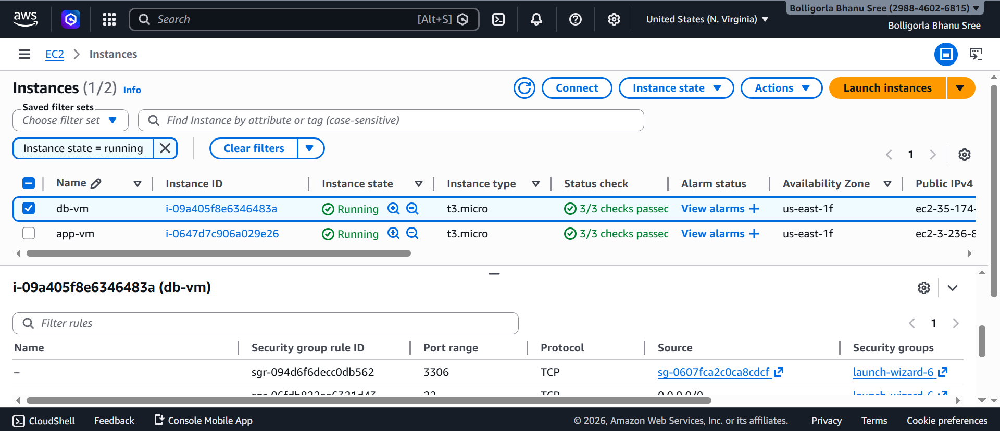
##  3.4 Connect to EC2 Instances

Use SSH:

```bash
ssh -i your-key.pem ubuntu@<public-ip>
```
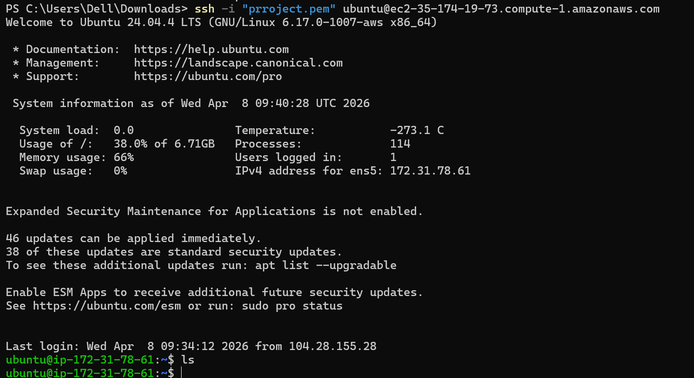
---

##  3.5 Get Private IP of DB Server

Run:

```bash
hostname -I
```

Example:

```
172.31.78.61
```

 This IP will be used in JDBC connection

---

## 4.  Application Server Setup (Tomcat)

---

### 4.1 Install Java

```bash
sudo apt update
sudo apt install openjdk-11-jdk -y
sudo apt install maven -y
```
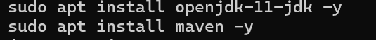
---

### 4.2 Install Tomcat 9

```bash
cd /opt
sudo wget https://archive.apache.org/dist/tomcat/tomcat-9/v9.0.117/bin/apache-tomcat-9.0.117.tar.gz
sudo tar -xvzf apache-tomcat-9.0.117.tar.gz
sudo mv apache-tomcat-9.0.117 tomcat9
```
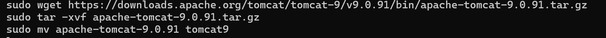
---

### 4.3 Start Tomcat

```bash
sudo /opt/tomcat9/bin/startup.sh
```

---

### 4.4 Verify

```bash
sudo ss -tlnp | grep 8080
```
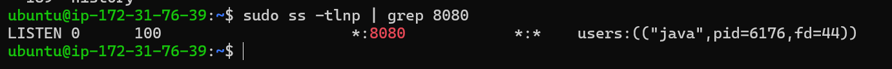
---

### 4.5 Access Tomcat

```
http://<APP-SERVER-PUBLIC-IP>:8080
```

---

## 5.  Database Server Setup (MySQL)

---

### 5.1 Install MySQL

```bash
sudo apt update
sudo apt install mysql-server -y
```
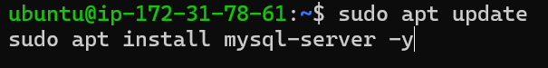
---

### 5.2 Enable Remote Access

```bash
sudo nano /etc/mysql/mysql.conf.d/mysqld.cnf
```
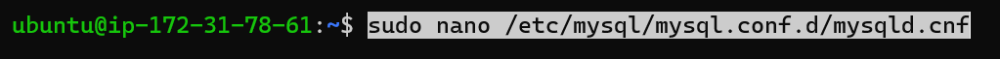

Change:

```
bind-address = 0.0.0.0
```
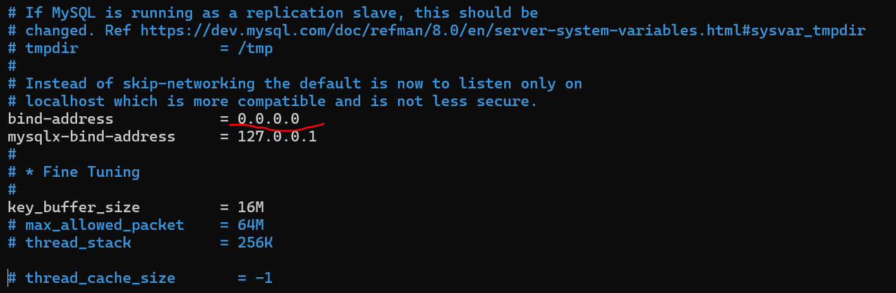
Restart:

```bash
sudo systemctl restart mysql
```

---

### 5.3 Verify MySQL Running

```bash
sudo ss -tlnp | grep 3306
```
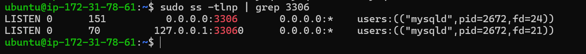
---

### 5.4 Create Database & User

```sql
CREATE DATABASE jet;

CREATE USER 'appuser'@'%' IDENTIFIED BY 'Appuser@123';

GRANT ALL PRIVILEGES ON jet.* TO 'appuser'@'%';

FLUSH PRIVILEGES;
```
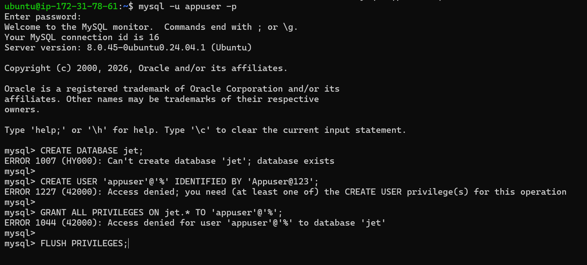
---

## 6.  Test Connectivity

From App Server:

```bash
nc -zv 172.31.78.61 3306
```
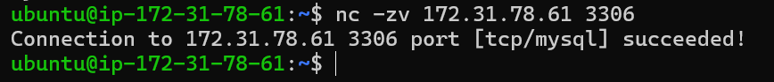
 Should show:

```
succeeded
```

---

## 7.  Deploy Application

---

### 7.1 Build WAR

```bash
cd ~/aws-rds-java
mvn clean package
```
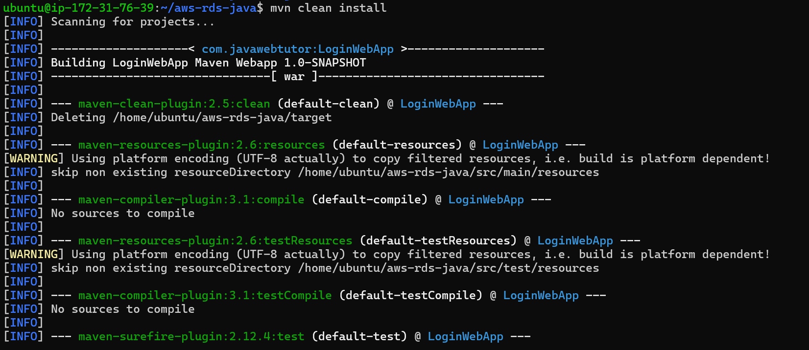
---

### 7.2 Deploy to Tomcat

```bash
sudo cp target/aws-rds-java.war /opt/tomcat9/webapps/
```

---

### 7.3 Restart Tomcat

```bash
sudo /opt/tomcat9/bin/shutdown.sh
sudo /opt/tomcat9/bin/startup.sh
```
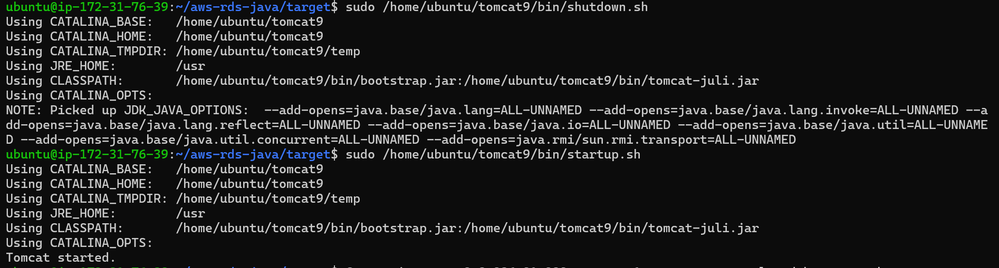
---

## 8.  Add MySQL Driver

```bash
wget https://repo1.maven.org/maven2/com/mysql/mysql-connector-j/8.3.0/mysql-connector-j-8.3.0.jar
sudo cp mysql-connector-j-8.3.0.jar /opt/tomcat9/lib/
```

Restart Tomcat.

---

## 9.  Access Application

```
http://<APP-SERVER-IP>:8080/aws-rds-java/
```
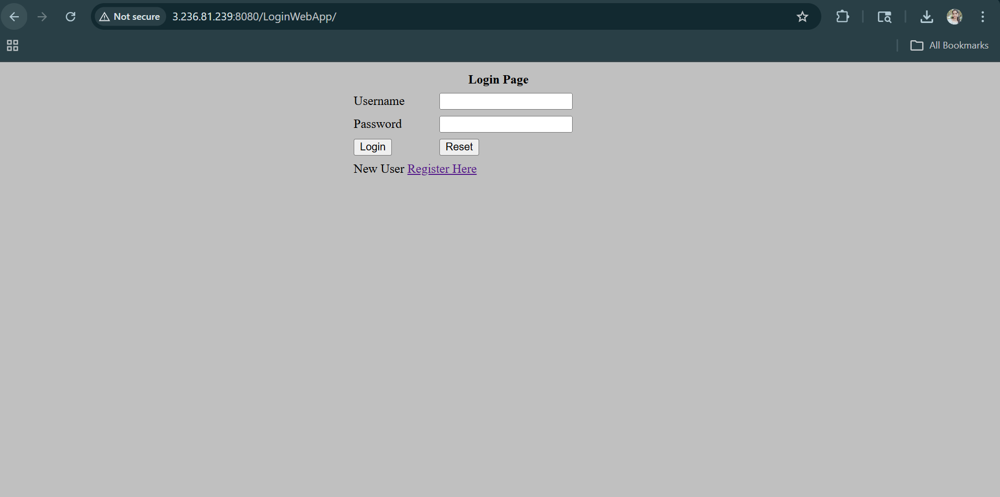
---
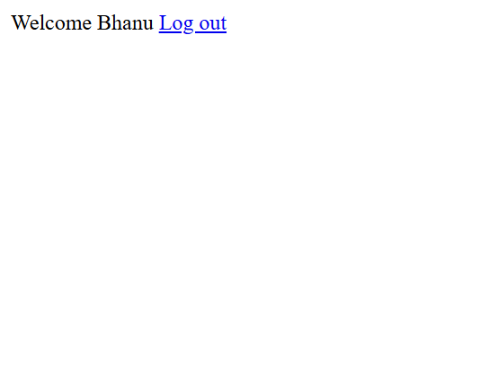
## 10.  JSP Code

(Working version)

```jsp
<%@ page import="java.sql.*" %>
<%
    String userName = request.getParameter("userName");
    String password = request.getParameter("password");
    String firstName = request.getParameter("firstName");
    String lastName = request.getParameter("lastName");
    String email = request.getParameter("email");

    Class.forName("com.mysql.cj.jdbc.Driver");

    String dbUrl = "jdbc:mysql://172.31.78.61:3306/jet?useSSL=false&allowPublicKeyRetrieval=true&serverTimezone=UTC";

    Connection con = DriverManager.getConnection(dbUrl, "appuser", "Appuser@123");

    Statement st = con.createStatement();

    int i = st.executeUpdate(
        "INSERT INTO USER(first_name, last_name, email, username, password, regdate) " +
        "VALUES ('" + firstName + "','" + lastName + "','" + email + "','" + userName + "','" + password + "', CURDATE())"
    );

    if (i > 0) {
        response.sendRedirect("welcome.jsp");
    } else {
        response.sendRedirect("index.jsp");
    }

    st.close();
    con.close();
%>
```

---

## 11.  Common Issues

| Issue                | Cause            | Fix          |
| -------------------- | ---------------- | ------------ |
| Connection timed out | SG blocked       | Open 3306    |
| 404 error            | App not deployed | Copy WAR     |
| ClassNotFound        | Driver missing   | Add JAR      |
| JSP compile error    | Encoding issue   | Rewrite file |

---

## 12.  Deployment Workflow

```bash
mvn clean package
cp WAR → webapps
restart Tomcat
```
Data Should be stored in the tables in database.
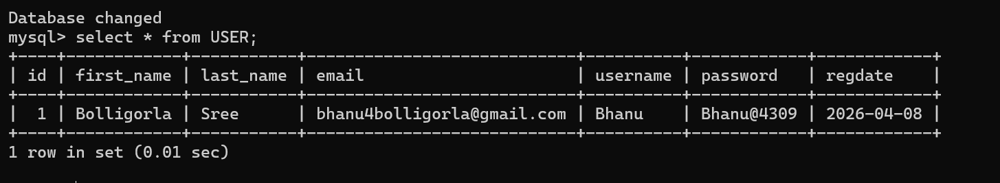
---

## 13.  Final Result

* Two EC2 VMs created
* App deployed successfully
* DB connected via private IP
* Registration working

---

##  Conclusion

This project demonstrates:

* Cloud infrastructure setup (VMs)
* Web server deployment
* Database connectivity
* Debugging real-world issues

---


