---

# **Enterprise Disaster Recovery & Backup Architecture**

**Level:** Advanced

**Domain:** Storage + Backup + Disaster Recovery (DR)

**Estimated Duration:** 5–6 Hours

---

## **Project Overview**

This project demonstrates the design and implementation of an **Enterprise Disaster Recovery (DR) solution** on AWS for a financial services company. The company requires:

* **Recovery Point Objective (RPO): 1 hour**
* **Recovery Time Objective (RTO): 4 hours**

The solution ensures business continuity and data protection by implementing:

* **EC2 workloads** with gp3 EBS volumes
* **Shared file systems** using Amazon EFS
* **S3 Cross-Region Replication (CRR)** for disaster recovery
* **AWS Backup Vaults and Backup Plans** for automated snapshots, EFS, and AMI backups

This architecture allows seamless failover and recovery in case of an infrastructure outage in the primary region.

---

## **1. AWS Services Used**

| Service    | Purpose                                                        |
| ---------- | -------------------------------------------------------------- |
| EC2        | Hosts Ubuntu workloads and applications                        |
| EBS (gp3)  | Block storage attached to EC2, supports snapshots and resizing |
| EFS        | Shared file system accessible from multiple EC2 instances      |
| S3         | Storage for backup and disaster recovery replication           |
| AWS Backup | Automates backup for EBS volumes, EFS, and AMIs                |
| KMS        | Provides encryption for S3 buckets and backup vaults           |

---

## **2. Architecture Overview**

**High-level Architecture:**

* Two Ubuntu EC2 instances in **us-east-1**
* Each instance has **gp3 EBS volumes** attached
* **Amazon EFS** mounted on both nodes via NFS
* **Primary S3 bucket** (`finance-backup-primary`) with **cross-region replication** to DR bucket (`finance-backup-dr`) in **us-west-2**
* **AWS Backup vault** (`finance-backup-vault-primary`) stores snapshots, EFS backups, and AMIs with **cross-region copy**

**Conceptual Diagram:**

```
EC2 Node 1 (Ubuntu) ── gp3 EBS Volume ──┐
                                        ├─> AWS Backup Vault → Cross-region DR Copy
EC2 Node 2 (Ubuntu) ── gp3 EBS Volume ──┘
           │
           └─> Amazon EFS (Shared Storage via NFS)
Primary S3 Bucket (finance-backup-primary)
           │
           └─> Cross-Region Replication → DR S3 Bucket (finance-backup-dr)
```

---

## **3. Step-by-Step Implementation**

### **Step 3.1 — Launch EC2 Instances**

1. Open **AWS Console → EC2 → Launch Instance**
2. Select **Ubuntu Server 22.04 LTS (Free Tier)**
3. Instance Type: `t2.micro`
4. Configure Networking: default VPC and subnet
5. Security Group: allow **SSH (22), NFS (2049), ICMP (optional)**
6. Key Pair: create or use an existing one
7. Launch **two instances**: `ubuntu1` and `ubuntu2`
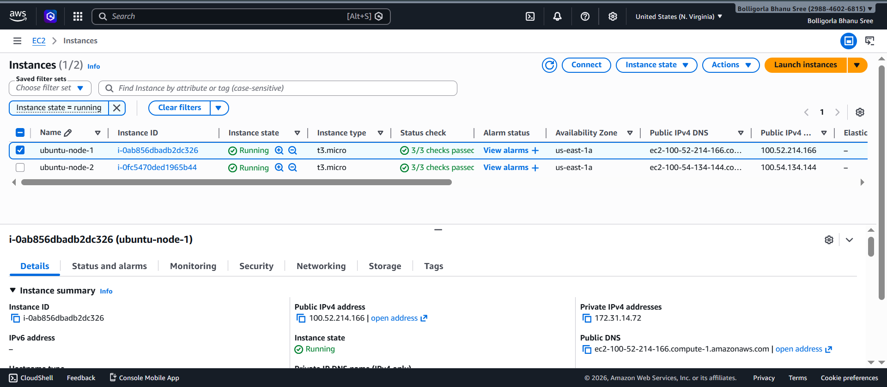
---

### **Step 3.2 — Attach and Configure gp3 EBS Volumes**

1. Navigate **EC2 → Volumes → Create Volume**

   * Type: `gp3`
   * Size: 100 GB
   * Availability Zone: same as EC2 instance
2. Attach the volume to EC2 instances (`ubuntu1` and `ubuntu2`)
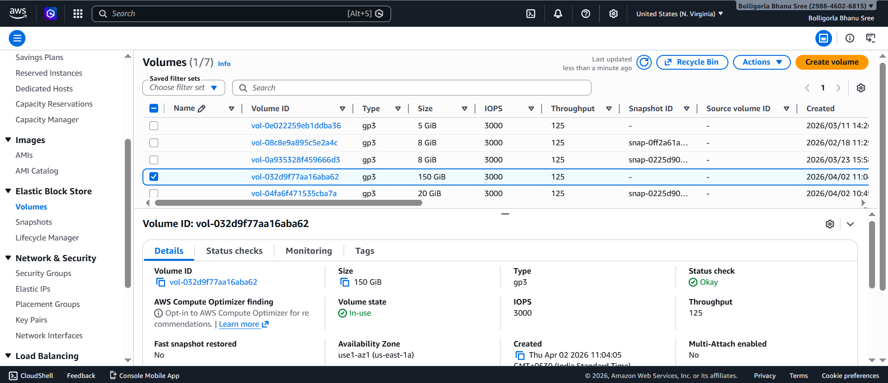
3. SSH into each instance and resize the volume:

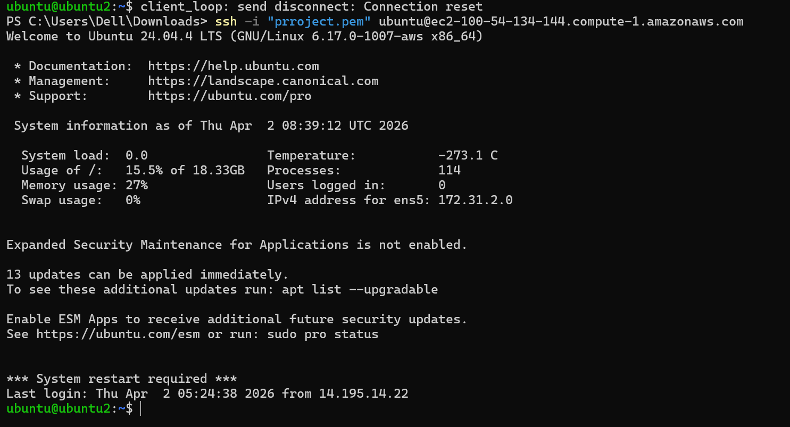

```bash
lsblk
sudo growpart /dev/nvme0n1 1
sudo resize2fs /dev/nvme0n1p1
df -h   # Verify resized space
```
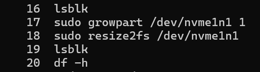
* Expand volume to **150 GB** without downtime.

---

### **Step 3.3 — Install NFS Utilities for EFS**

```bash
sudo apt update
sudo apt install -y nfs-common
```
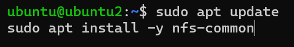
---

### **Step 3.4 — Create and Mount Amazon EFS**

1. Open **AWS Console → EFS → Create File System**

   * Name: `finance-efs`
   * VPC: same as EC2
   * Performance Mode: General Purpose
   * Throughput Mode: Bursting

   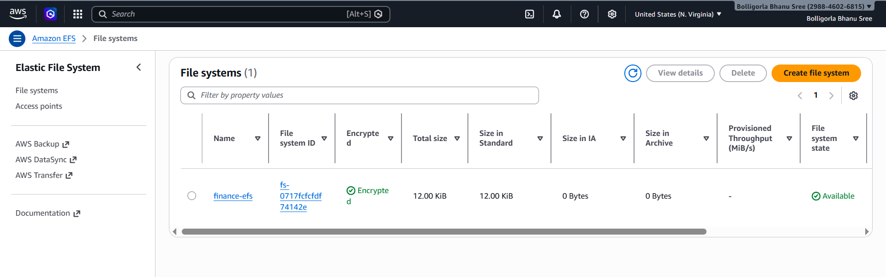
2. Add **Mount Targets** for all subnets where EC2 nodes reside
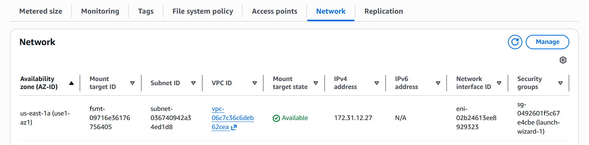
**Mount EFS on EC2 Instances:**

```bash
sudo mkdir -p /shared
sudo mount -t nfs -o vers=4.1 fs-<EFS-ID>.efs.us-east-1.amazonaws.com:/ /shared
```
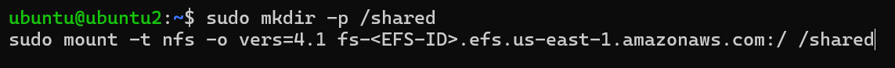
**Auto-mount on reboot:**

```bash
echo "fs-<EFS-ID>.efs.us-east-1.amazonaws.com:/ /shared nfs4 defaults,_netdev 0 0" | sudo tee -a /etc/fstab
```
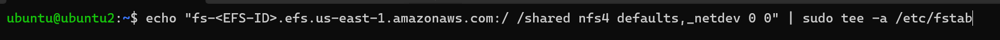

* Test shared access:

```bash
echo "Hello from Node1" | sudo tee /shared/test-node1.txt
cat /shared/test-node1.txt  # Verify from Node2
```
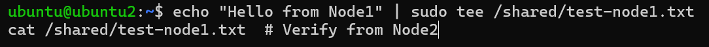
---

### **Step 3.5 — Install AWS CLI v2**

```bash
curl "https://awscli.amazonaws.com/awscli-exe-linux-x86_64.zip" -o "awscliv2.zip"
sudo apt install -y unzip
unzip awscliv2.zip
sudo ./aws/install
aws --version
aws configure
```
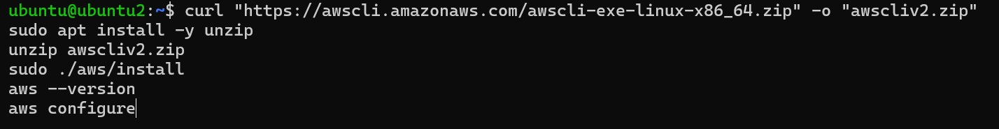

* Configure with AWS Access Key ID, Secret Key, default region `us-east-1`, and output `json`.

---

### **Step 3.6 — Create S3 Buckets and Enable Cross-Region Replication**

**Primary Bucket:**

* Name: `finance-backup-primary`
* Region: `us-east-1`
* Enable **Versioning** and **SSE-KMS Encryption**

**DR Bucket:**

* Name: `finance-backup-dr`
* Region: `us-west-2`
* Enable **Versioning** and **SSE-KMS Encryption**
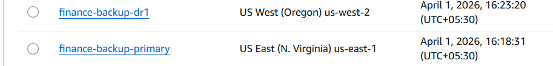
**Configure CRR:**

1. Go to **finance-backup-primary → Management → Replication → Create Rule**
2. Rule Name: `finance-crr-rule`
3. Prefix: **leave blank** to replicate entire bucket
4. Destination Bucket: `finance-backup-dr`
5. IAM Role: Auto-create
6. Enable options: replicate existing objects and delete markers
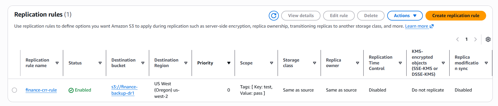
**Test replication:**

```bash
echo "S3 replication test node1" > test-node1.txt
aws s3 cp test-node1.txt s3://finance-backup-primary/
aws s3 ls s3://finance-backup-dr/  # Verify replication
```
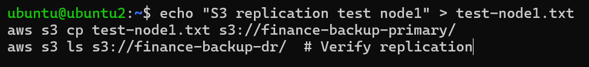
---

### **Step 3.7 — Configure AWS Backup**

**Create Backup Vault:**

* Name: `finance-backup-vault-primary`
* Encryption: KMS

**Create Backup Plan:**

* Name: `finance-dr-plan`

| Rule              | Resource                 | Frequency | Retention | Notes                 |
| ----------------- | ------------------------ | --------- | --------- | --------------------- |
| Hourly EBS Backup | EBS gp3 Volumes          | Hourly    | 24 hours  | Meets RPO 1h          |
| Daily Backup      | EFS + AMIs               | Daily     | 30 days   | Supports RTO recovery |
| Cross-Region Copy | Backup Vault → DR Region | N/A       | 1 year    | Long-term DR storage  |

**Assign Resources:**

* EC2 instances
* gp3 EBS Volumes
* EFS file system

**Manual Backup Test:**

* AWS Backup → Protected Resources → Backup Now
* Verify Recovery Points = Completed

---

### **Step 3.8 — Disaster Recovery Test**

1. Stop **EC2 instance `ubuntu1`**
2. Restore EC2 from **AWS Backup**
3. Attach restored gp3 volume:

```bash
sudo mount /dev/nvme1n1 /data
```

4. Remount EFS:

```bash
sudo mount -t nfs -o vers=4.1 fs-<EFS-ID>.efs.us-east-1.amazonaws.com:/ /shared
```

5. Validate data:

```bash
ls /data      # EBS content
ls /shared    # EFS content
aws s3 ls s3://finance-backup-dr/  # Verify replicated objects
```

---

### **Step 3.9 — Validate RPO & RTO**

| Metric | Requirement | Achieved                            |
| ------ | ----------- | ----------------------------------- |
| RPO    | 1 hour      | Hourly EBS snapshots completed     |
| RTO    | 4 hours     | AMI restore + EFS mount completed  |

---

### **Step 3.10 — Automation**

* `/etc/fstab` ensures **EFS auto-mount** on reboot
* AWS Backup runs automatically according to plan
* S3 replication runs automatically
* Manual intervention only required for full EC2 restore

---

## **4. Key Concepts Demonstrated**

* EC2 + gp3 EBS volume backup and resizing
* Shared storage via Amazon EFS
* S3 Cross-Region Replication (CRR)
* AWS Backup Vaults and Plans
* Disaster Recovery with validated RPO and RTO

---

## **5. Summary**

This project demonstrates a **fully automated Enterprise Disaster Recovery architecture**:

* EC2 workloads backed by **EBS snapshots and AMIs**
* Shared storage provided by **Amazon EFS**
* Automated backups via **AWS Backup Vault**
* **S3 CRR** ensures cross-region disaster recovery
* Verified **RPO = 1 hour** and **RTO = 4 hours**

This architecture ensures **business continuity and data protection** for financial workloads on AWS.

---


