---

#  Serverless Image Processing Pipeline (AWS)

##  1. Overview

This project implements a **fully serverless image processing pipeline** using AWS services. The system allows users to upload images securely via **pre-signed URLs**, automatically processes them using AWS Lambda, and stores optimized outputs while managing storage costs using lifecycle policies and cross-region replication.

The architecture eliminates the need for traditional servers, ensuring **scalability, fault tolerance, and cost efficiency**.

---

##  2. Objectives

* Enable secure image uploads without exposing backend servers
* Automatically process images (resize and watermark)
* Store processed images separately from raw uploads
* Implement cost optimization using lifecycle policies
* Ensure high availability using cross-region replication
* Handle failures using a dead-letter queue (DLQ)

---

##  3. Architecture Overview

```
Client (Browser / CLI)
        ↓
API Gateway + Lambda (Generate Pre-Signed URL)
        ↓
S3 Bucket (raw-uploads/)
        ↓ (S3 Event Trigger)
Lambda (Image Processing)
        ↓
S3 Bucket (processed-images/)
        ↓
End Users / Applications
```

---


# 1. Prerequisites

Before starting, ensure the following:

* AWS account with appropriate permissions
* AWS CLI installed and configured (`aws configure`)
* Python 3.11 installed locally
* Basic knowledge of IAM, S3, and Lambda

---

# 2. S3 Bucket Setup

## 2.1 Create Raw Upload Bucket

1. Go to AWS S3 Console
2. Click **Create bucket**
3. Bucket name: `raw-uploads-bucket86`
4. Region: `us-east-1`
5. Enable:

   * Versioning
   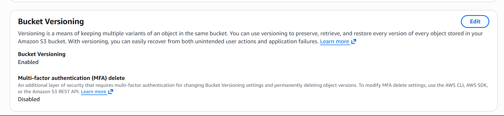
   * Default encryption: **SSE-S3**
   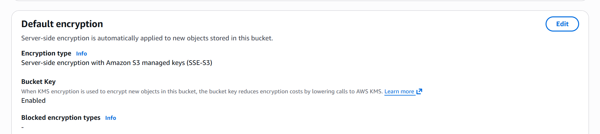
6. Disable public access (recommended)
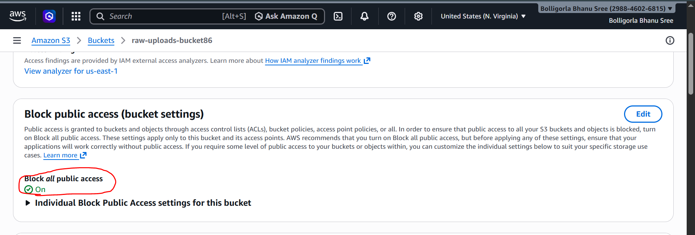
7. Create bucket


---

## 2.2 Configure CORS for Raw Bucket

Navigate to:

* Bucket → Permissions → CORS configuration

Add:

```json
[
  {
    "AllowedHeaders": ["*"],
    "AllowedMethods": ["PUT", "GET"],
    "AllowedOrigins": ["*"],
    "ExposeHeaders": []
  }
]
```
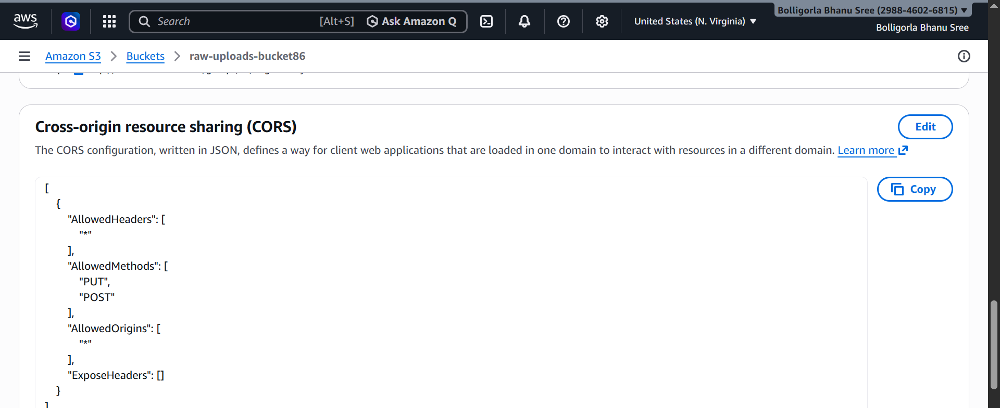

---

## 2.3 Create Processed Images Bucket

1. Create another bucket
2. Bucket name: `processed-images-bucket86`
3. Enable versioning
4. Enable encryption:

   * Choose **SSE-KMS**
   * Create a new KMS key (alias: `processed-images-key`)
   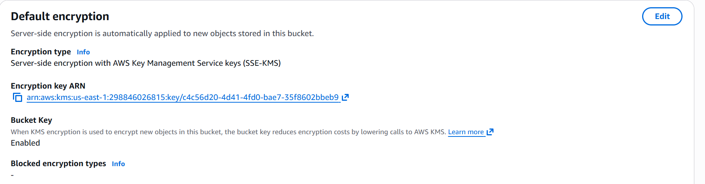

---

# 3. Cross-Region Replication (CRR)

## 3.1 Create Destination Bucket (EU Region)

1. Create bucket in `eu-west-1`
2. Enable versioning
3. Keep encryption enabled

---

## 3.2 Configure Replication

1. Go to source bucket (`raw-uploads-bucket86`)
2. Open **Management → Replication rules**
3. Create rule:

   * Rule name: `replicate-raw-uploads`
   * Scope: Prefix = `raw-uploads/`
   * Destination bucket: EU bucket
4. Create IAM role when prompted
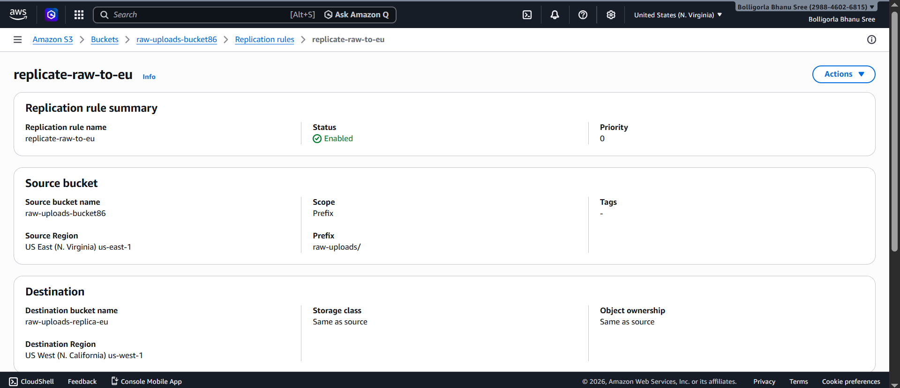
---

# 4. Lifecycle Policy Configuration

Apply to both buckets:

1. Go to **Management → Lifecycle rules**
2. Create rule:

   * Apply to all objects or specific prefix

### Transitions:

* After 30 days → Standard-IA
* After 90 days → Glacier
* After 365 days → Deep Archive
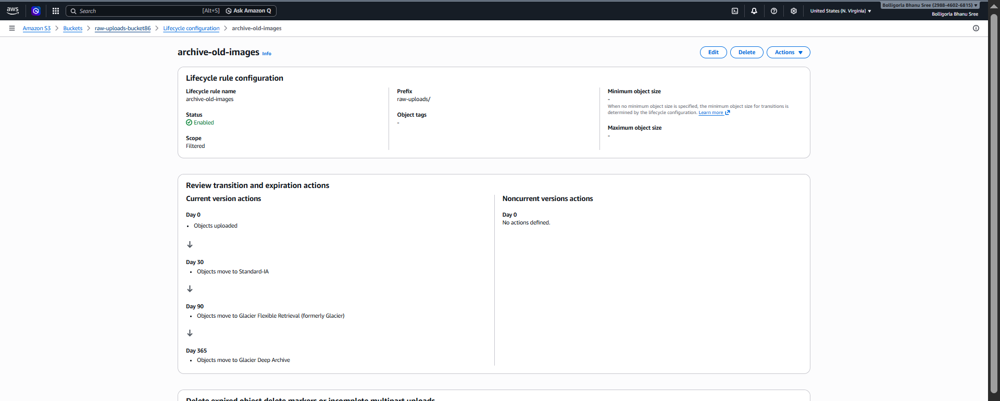
---

# 5. Lambda Function for Pre-Signed URL

## 5.1 Create Lambda

1. Go to AWS Lambda Console
2. Create function:

   * Name: `generate-presigned-url`
   * Runtime: Node.js 18.x
   * Permissions: Create new role with S3 access
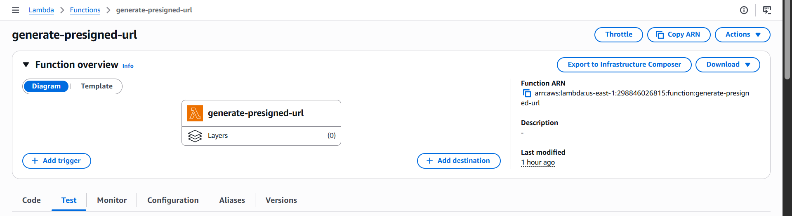
---

## 5.2 Attach IAM Policy

Add permissions:

```json
{
  "Effect": "Allow",
  "Action": [
    "s3:PutObject"
  ],
  "Resource": "arn:aws:s3:::raw-uploads-bucket86/*"
}
```
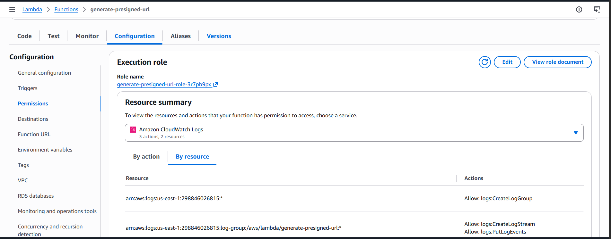
---

## 5.3 Lambda Code

```javascript
import { S3Client, PutObjectCommand } from "@aws-sdk/client-s3";
import { getSignedUrl } from "@aws-sdk/s3-request-presigner";
import { v4 as uuidv4 } from "uuid";

const s3 = new S3Client({ region: "us-east-1" });

export const handler = async (event) => {
  const { file_name, content_type } = JSON.parse(event.body);

  const key = `raw-uploads/${uuidv4()}-${file_name}`;

  const command = new PutObjectCommand({
    Bucket: "raw-uploads-bucket86",
    Key: key,
    ContentType: content_type,
  });

  const upload_url = await getSignedUrl(s3, command, { expiresIn: 300 });

  const file_url = `https://raw-uploads-bucket86.s3.amazonaws.com/${key}`;

  return {
    statusCode: 200,
    body: JSON.stringify({ upload_url, file_url }),
  };
};
```

---

# 6. API Gateway Setup

1. Go to API Gateway
2. Create HTTP API
3. Add integration → Lambda → `generate-presigned-url`
4. Create route:

   * POST `/generate-url`
5. Deploy API
6. Copy endpoint URL

---

# 7. Lambda for Image Processing

## 7.1 Create Lambda Function

* Name: `image-processing-function`
* Runtime: Python 3.11
* Memory: 512 MB
* Timeout: 30 seconds

---

## 7.2 Add S3 Trigger

* Event: ObjectCreated
* Bucket: `raw-uploads-bucket86`
* Prefix: `raw-uploads/`

---

## 7.3 IAM Permissions

Attach policy:

```json
{
  "Effect": "Allow",
  "Action": [
    "s3:GetObject",
    "s3:PutObject"
  ],
  "Resource": [
    "arn:aws:s3:::raw-uploads-bucket86/*",
    "arn:aws:s3:::processed-images-bucket86/*"
  ]
}
```

---

## 7.4 Lambda Code (Python)

```python
import boto3
from PIL import Image, ImageDraw
import io
import urllib.parse

s3 = boto3.client('s3')
DEST_BUCKET = "processed-images-bucket86"

def lambda_handler(event, context):
    for record in event['Records']:
        bucket = record['s3']['bucket']['name']
        key = urllib.parse.unquote_plus(record['s3']['object']['key'])

        response = s3.get_object(Bucket=bucket, Key=key)
        image_data = response['Body'].read()

        image = Image.open(io.BytesIO(image_data))
        image = image.resize((800, 600))

        draw = ImageDraw.Draw(image)
        draw.text((10, 10), "MyCompany")

        buffer = io.BytesIO()
        image.save(buffer, "JPEG")
        buffer.seek(0)

        new_key = key.replace("raw-uploads/", "processed/")

        s3.put_object(
            Bucket=DEST_BUCKET,
            Key=new_key,
            Body=buffer,
            ContentType="image/jpeg"
        )
```
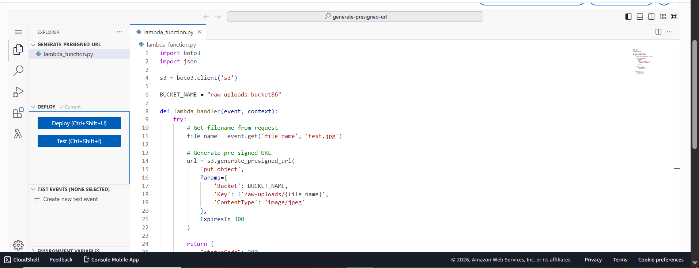
---

# 8. Lambda Layer (Pillow)

## Steps:

```bash
pip install pillow -t python/
zip -r layer.zip python/
```

1. Upload as Lambda Layer
2. Attach layer to image-processing Lambda

---

# 9. SQS Dead Letter Queue

## 9.1 Create Queue

* Name: `image-processing-dlq`

## 9.2 Attach to Lambda

* Go to Lambda → Configuration → Destinations
* On failure → Select SQS queue

---

# 10. Testing the Pipeline

## Step 1: Generate URL

Send POST request:

```json
{
  "file_name": "image.png",
  "content_type": "image/png"
}
```
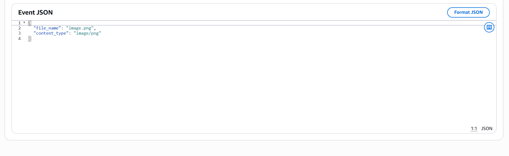
---

## Step 2: Upload File

Use curl:

```bash
curl -X PUT "<upload_url>" \
-H "Content-Type: image/png" \
--data-binary "@image.png"
```
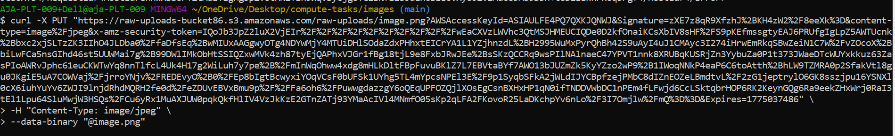
---

## Step 3: Verify

* Check raw bucket → file exists
* Check processed bucket → resized image exists
* Check DLQ → empty (no failures)
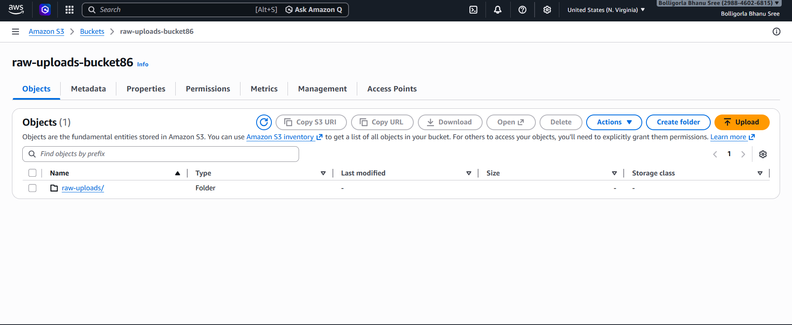
---

# 11. Validation Checklist

* Pre-signed URL works correctly
* File uploads to S3
* Lambda triggers automatically
* Processed image generated
* Lifecycle rules applied
* Replication working
* Failures captured in SQS

---

# 12. Final Outcome

This implementation results in:

* Secure file upload using pre-signed URLs
* Automatic image processing via event-driven Lambda
* Separation of raw and processed data
* Cost-efficient storage lifecycle management
* High availability through cross-region replication
* Reliable error handling using SQS


---

##  13. Conclusion

This project demonstrates a **scalable and cost-efficient serverless architecture** for handling large-scale image uploads and processing.

By leveraging AWS managed services, the system achieves:

* High scalability without infrastructure management
* Automated processing using event-driven workflows
* Secure data handling with encryption and pre-signed URLs
* Cost optimization through lifecycle policies
* Reliability through failure handling mechanisms

---


