# **Project Documentation: Scalable AWS E-Commerce Web Application**

---

## **1. Project Overview**

**Project Name:** Scalable AWS E-Commerce Web Application

**Objective:**
Design and deploy a highly available, scalable, fault-tolerant web application capable of handling traffic spikes (e.g., during sales like Black Friday). The system uses AWS services to ensure high availability, auto-scaling, and secure internal architecture.

**Key Features:**

* Load balanced across multiple Availability Zones
* Auto-scaling based on traffic
* Encrypted EBS volumes for application data
* Static assets served from S3
* Private EC2 instances for enhanced security

**AWS Services Used:**

* **EC2:** t3.micro / t3.small instances for web application
* **Auto Scaling Groups (ASG):** For dynamic scaling
* **Application Load Balancer (ALB):** Distributes traffic across EC2 instances
* **EBS gp3:** Encrypted storage attached to EC2
* **S3:** Stores static assets (CSS, JS, images)
* **AMI:** Golden AMI with pre-installed application
* **VPC:** Public and private subnets for secure architecture

---

## **2. Architecture Overview**

**Simplified Architecture Flow:**


**Components:**

1. **VPC:**

   * Custom VPC with public and private subnets across 2 Availability Zones
   * Public subnets → ALB
   * Private subnets → EC2 instances

2. **ALB:**

   * Internet-facing
   * HTTP:80 listener
   * Cross-zone load balancing enabled
   * Sticky sessions: 1 hour

3. **EC2 Instances:**

   * Private subnets, multiple AZs
   * Launch using Golden AMI (pre-installed Apache/Nginx + app)
   * Auto Scaling group attached

4. **EBS gp3 Volumes:**

   * 20 GB per EC2 instance
   * Encrypted using AWS KMS

5. **S3 Bucket:**

   * Stores static assets
   * Versioning enabled for backup

6. **Auto Scaling Group:**

   * Desired: 2, Min: 2, Max: 4
   * Target tracking based on CPU (50%)
   * Private subnet deployment

7. **Security:**

   * EC2 SG: Only allows HTTP from ALB
   * ALB SG: Allows HTTP from 0.0.0.0/0
   * No SSH (optional SSM for management)

---

## **3. Step-by-Step Deployment Guide**

### **Step 1: Create VPC**

1. Go to **VPC → Create VPC**
2. Name: `ecommerce-vpc`
3. IPv4 CIDR: `10.0.0.0/16`

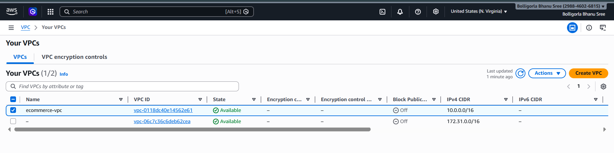

---

### **Step 2: Create Subnets**

* **Public Subnets:**

  * `public-subnet-1a` → 10.0.1.0/24
  * `public-subnet-1b` → 10.0.2.0/24

  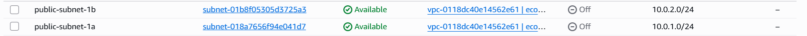
* **Private Subnets:**

  * `private-subnet-1a` → 10.0.3.0/24
  * `private-subnet-1b` → 10.0.4.0/24

   

---

### **Step 3: Internet Gateway**

1. Create Internet Gateway
2. Attach to `ecommerce-vpc`

    
3. Add route `0.0.0.0/0 → IGW` in Public Route Table

   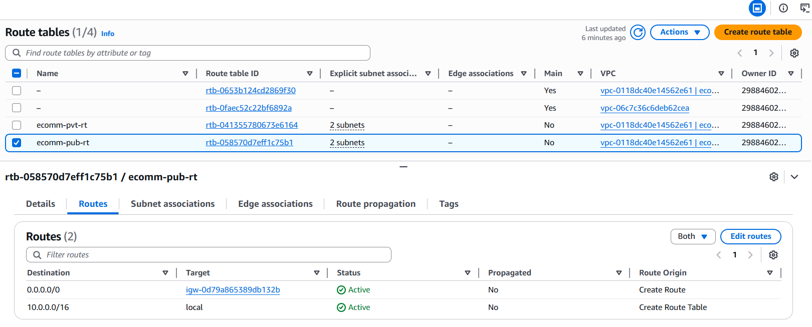 

### **Final Network architecture :**

   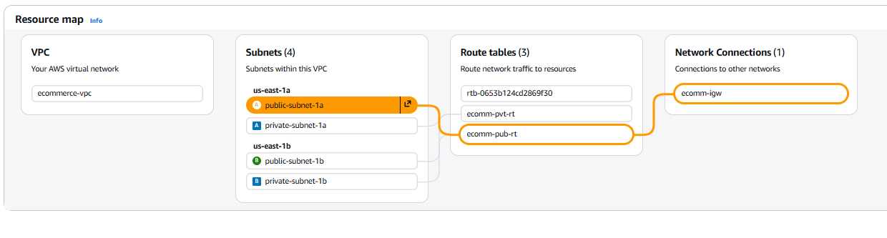
---

### **Step 4: Security Groups**

#### ALB Security Group (`alb-sg`):

* Inbound: HTTP 80 → 0.0.0.0/0
* Outbound: Allow all

  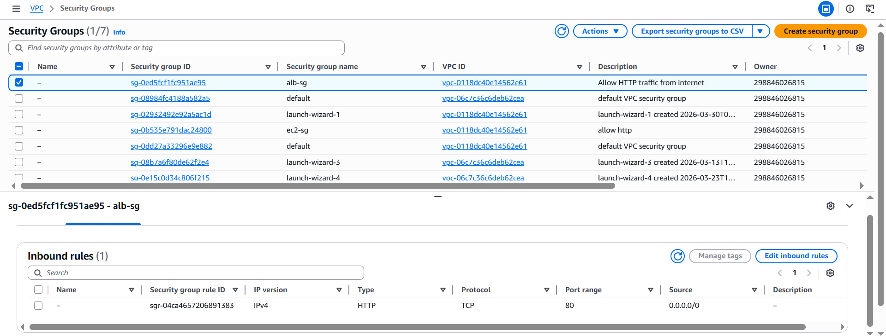

#### EC2 Security Group (`ec2-sg`):

* Inbound: HTTP 80 → `alb-sg` only
* Outbound: Allow all

  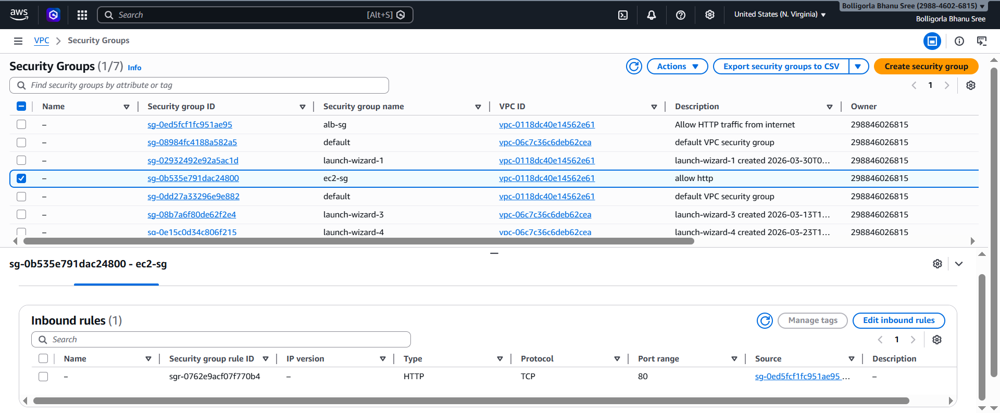

> **Note:** No SSH required; optional SSM access for management

---

### **Step 5: S3 Bucket**

1. Create S3 bucket: `ecommerce-static-assets-xyz`
2. Enable **Versioning**

  
3. Upload static files: images, CSS, JS
4. Optional: Set permissions to public if needed for website access
  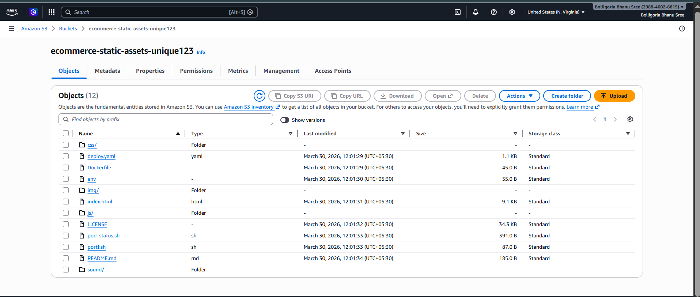

---

### **Step 6: Create Golden AMI**

1. Launch temporary EC2 instance in public subnet
2. Install Apache/Nginx and application code:

```bash
sudo apt update -y
sudo apt install httpd -y
sudo systemctl start httpd
sudo rm -rf * /var/www/html/
sudo git clone code_repo_git_url /var/www/html/
```

3. Create AMI from this instance → `golden-ami-ecommerce`
  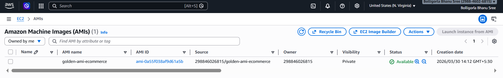
4. Terminate temporary instance

---

### **Step 7: Create Launch Template**

* AMI: `golden-ami-ecommerce`
* Instance type: t3.micro / t3.small
* Security Group: `ec2-sg`
* Storage: gp3, 20 GB, encrypted

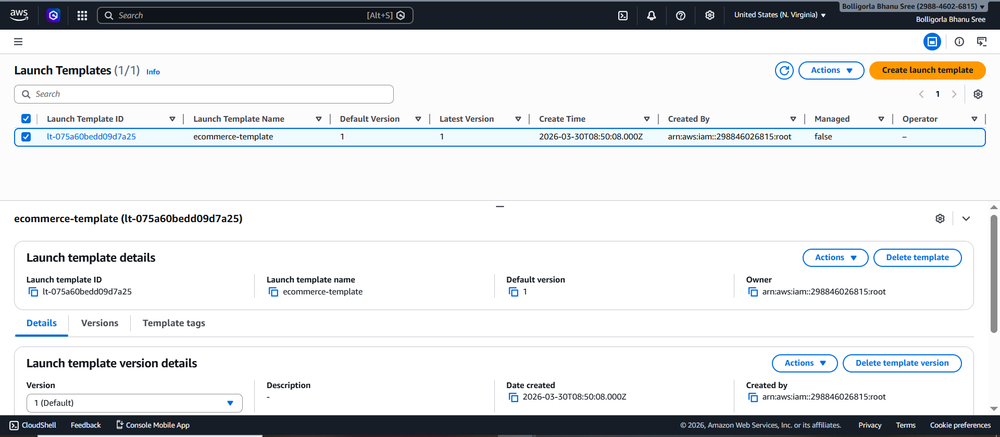
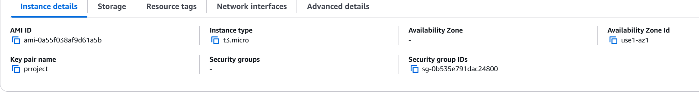
---

### **Step 8: Create Target Group**

* Type: Instances
* Protocol: HTTP, Port 80
* Health check: `/`
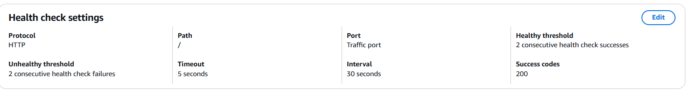
* Attach ASG later


---

### **Step 9: Create Application Load Balancer**

1. Internet-facing, HTTP 80
2. Subnets: `public-subnet-1a`, `public-subnet-1b`

  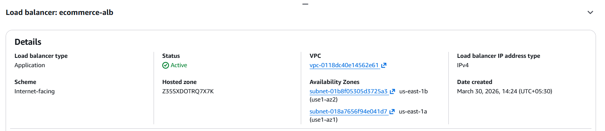
3. Security Group: `alb-sg`

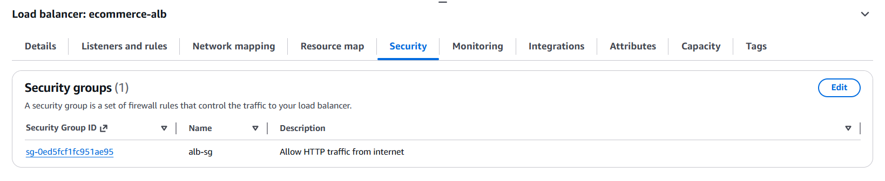

4. Attach Target Group: `ecommerce-tg`
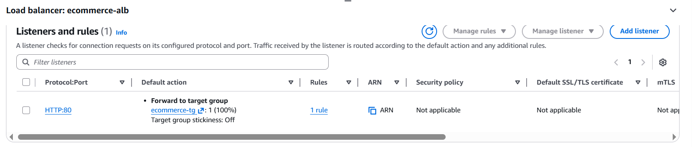
5. Enable cross-zone load balancing
6. Enable sticky sessions: 3600 seconds
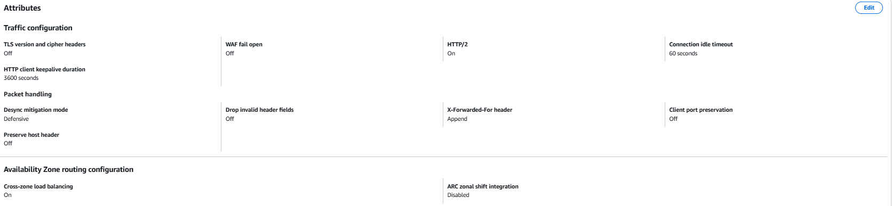
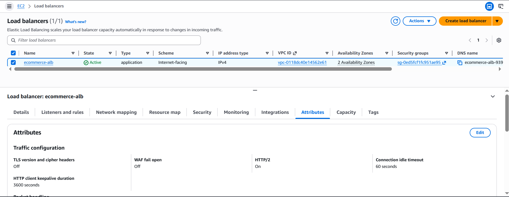
---

### **Step 10: Create Auto Scaling Group**

1. Launch Template: `ecommerce-template`
2. Subnets: `private-subnet-1a`, `private-subnet-1b`
3. Load Balancer: `ecommerce-tg`
4. Desired/Min/Max: 2 / 2 / 4
5. Health Checks: EC2 + ELB
6. Scaling Policy: CPU 50% target tracking

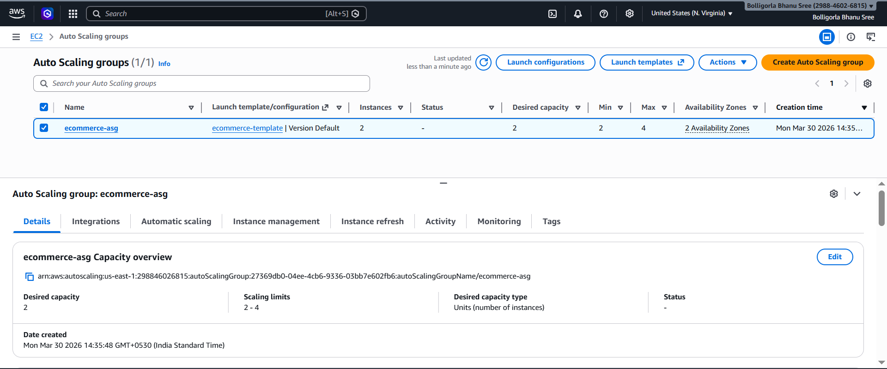
---

### **Step 11: Test Deployment**

1. Open ALB DNS in browser → page should load

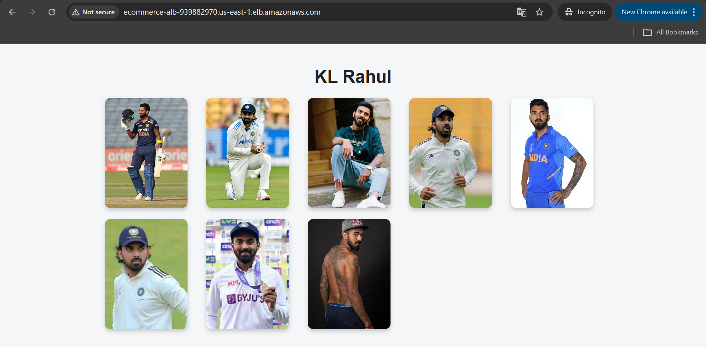
2. Stop one EC2 instance → app still works
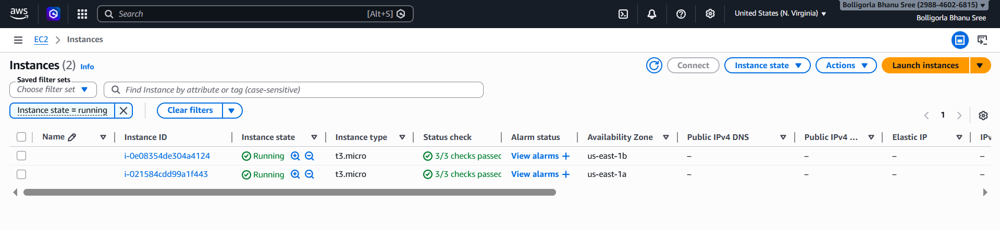
3. Increase load → ASG scales automatically
4. Verify Target Group → all instances Healthy

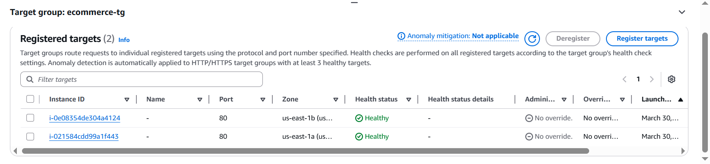

---


## **5. Key Learnings**

* Setting up **multi-AZ, load-balanced applications** in AWS
* Using **Golden AMI** for faster deployment
* Securing EC2 instances using private subnets & SGs
* Configuring **Auto Scaling Groups** with CPU-based policies
* Serving **static assets via S3** for scalability
* Understanding **cross-zone load balancing and sticky sessions**

---


